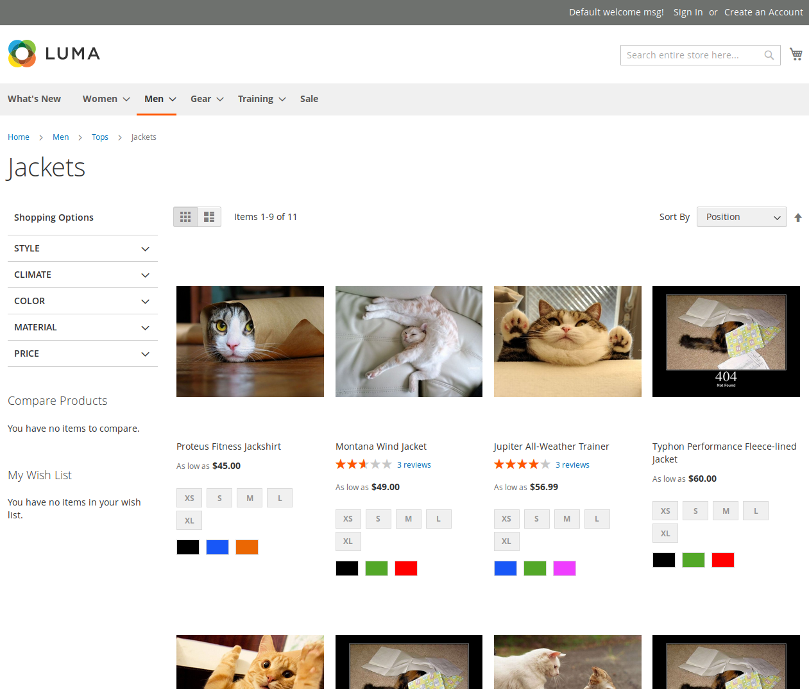

Random Cat Magento 2 Project
============================

Overview
--------

The purpose of this repository is to containerize the applciation and have fun with Magento 2 Modules.

Random Cat Magento 2 Project is a simple Magento 2 Commerce installation with sample data and one empty local module.
Your task will be to fill in this module with code to achieve the following feature:

Change all product photos in catalog listing to random cat photos using **Random Cat API**.

### Random Cat API

It's a simple JSON API with only one endpoint: http://randomcatapi.orbalab.com/

It is protected by API key. To be authorized you must pass `api_key` GET parameter to the endpoint. The key that you may use is `5up3rc0nf1d3n714llp455w0rdf0rc47s`.

As a response for request to this API you will get simple JSON object with just one attribute called "url", eg. `{"url": "http://supercats.com/randomkitty123.jpg"}`.

The API is heavily loaded, so from time to time (approximately 25% of all requests) it will not respond with HTTP status 200.

Collection of cats photos used by the API is a little bit outdated, so from time to time (approximately 30% of successfull requests) it will return URL pointing to a 404 page.

### Mockup

Installation and running the application
----------------------------------------

You can install application on your local environment or using Docker.

### Using Docker

You need to have Docker and Docker-Compose installed on your local machine.

1. Clone your forked repository (master branch) locally.
2. Copy `src/auth.json.sample` to `src/auth.json` and fill it in with [your Magento 2 authentication keys](https://devdocs.magento.com/guides/v2.2/install-gde/prereq/connect-auth.html).
3. Copy `.env.sample` to `.env` and change installation settings if you need.
4. CD to project root and run `docker-compose up`.
5. Go grab a coffee ;-). Installation will take some time.
6. Application will be accessible by the following address: `http://127.0.0.1:8080/`.
7. Unit tests can be executed by running the following command: `docker exec -it <CONTAINER_NAME> sh -c "cd /var/www/html/ && ./vendor/bin/phpunit -c dev/tests/unit/phpunit.xml.dist ./../modules/random-cat-module"`.
8. Composer can be executed by running the following command: `docker exec -it <CONTAINER_NAME> sh -c "cd /var/www/html && composer"`.
9. Magento console commands can be executed by running the following command: `docker exec -it <CONTAINER_NAME> sh -c "cd /var/www/html && bin/magento"`.
10. `<CONTAINER_NAME>` can be checked by running the following command: `docker ps`. It will be something like `orbam2cats_app_1_ed01e2011bb6`.

### Using PHP, Composer, MySQL and web server from your local machine

Your local machine needs to meet all requirements listed in official Magento 2 documentation: <https://devdocs.magento.com/guides/v2.2/install-gde/system-requirements-tech.html>

1. Clone your forked repository (master branch) locally.
2. Copy `src/auth.json.sample` to `src/auth.json` and fill it in with [your Magento 2 authentication keys](https://devdocs.magento.com/guides/v2.2/install-gde/prereq/connect-auth.html).
3. CD to `src` and run `composer install`.
4. Create local database for the project.
5. Set up local host and web server for the project.
6. Install Magento using `bin/magento setup:install` command.
7. Unit tests can be executed by running the following command from the project root: `cd src && ./vendor/bin/phpunit -c dev/tests/unit/phpunit.xml.dist ./../modules/random-cat-module"`.
